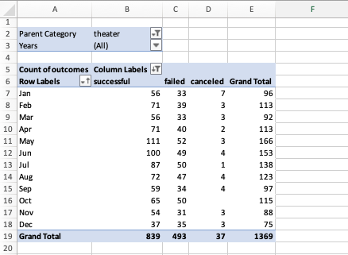
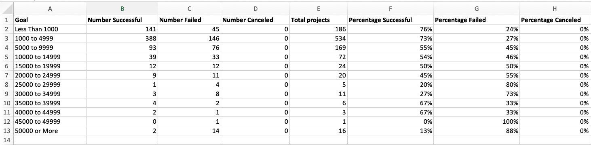

# kickstarter-analysis
## Project Overview  
The purpose of this project is to analyze crowdfunding data to uncover patterns of successful crowdfundings. Louise, a playwright wanted to fund her play called “Fever.” I gave her a detailed analysis of other crowdfunding projects focusing especially on theater projects. The dataset contained information of other types of projects from other industries such as publishing, technology, music, television, etc. I used this data to show how they compared to the theater crowdfunding projects. 

Louise came near to her fundraising goal but wanted to understand better how other campaigns performed in relation to their launch date and funding goals. I delivered a “Theater Outcomes Based on Launch Date” and “Outcomes Based on Goals” charts to show Louise the information she was looking for, so she could improve her efforts to fund her future projects. 
## Analysis and Challenges
The analysis was performed using the dataset called StarterBook.xlsx, I performed different analysis using this data. For instance, I started by applying conditional formatting to a specific column to color-code the outcomes to visualize them better. I also created a column to show how much of each project’s goal was met showing the percentage funded; this was done using the following formula:

```=ROUND(E2/D2*100,0)```

I also created an Average Donation Column and used the formula:

```=ROUND(E2/L2,2)```

*Note: The “2” after the coma indicates that we want two digits after the decimal.*

When applying this formula, I encountered the following error **_#DIV/0!_** that indicates that numbers are not divisible by 0.  I corrected the error by applying the following nested formula:

```=IFERROR(ROUND(E4/L4,2),0)```

I also created subcategories and pivot tables; this helped me familiarize myself with the data I was working with, so I could provide a good analysis to Louise. To understand how other campaigns performed in relation to their launch date and funding goals I provided Louise with two different analysis. 

First, I renamed the dataset to Kickstarter_Challenge.xlsx and added a column called **Years** to show the year when the campaigns were launched using the following formula.

```YEAR()```

Then, I created a pivot table so see the following data summarized: *Parent Category, Years,* and whether the campaigns were *successful, canceled or failed.* Being new to working with pivot tables, one of the challenges I encountered was that I didn’t know where to add the fields in order to show the information I wanted to see reflected in the pivot table. It also took me some time to figure out how to remove the “live” field, but once I did it, I was able to make progress much faster.

The following Pivot table was used to create a chart to show Louise that campaigns launched in certain months had a more successful rate. 



To show Louise the outcomes based on goals I created a new sheet where I added different columns to show the goal amount, the total number of projects and their outcomes and finally the respective percentage of each outcome. This is the structure of the table I created. 



To know how many crowdfunding campaigns were successful in the subcategory of "plays" I used the following formula: 

```=COUNTIFS(Kickstarter!$D:$D,"<1000",Kickstarter!$F:$F,"successful",Kickstarter!$R:$R,"plays")```

I adjusted the formula to match the goals for each row and column. To show the percentage I used the follwoing formula and changed the format of the row from general to percentage. I did it this way because it will help Louise identify that these numbers are percentages.

```=(B2/E2)```

I used this table to create a chart to show Louise that the goal amount was one of the key factors to a campaign success. This data gave us the following chart. 


One of the challenges I encountered with this analysis is that my first chart looked different than what was provided in the challenge instructions. It took me some time to realize that in cells number B13 and C13 I had missed a “0” in my formula and the number was 5000 instead of 50,000.

***Wrong formula:***
```=COUNTIFS(Kickstarter!$D:$D,">=5000",Kickstarter!$F:$F,"successful",Kickstarter!$R:$R,"plays")```


## Conclusions

Some conclusions we can draw from the Pivot chart created to display the Theater Outcomes by Launch Date are that the crowdfunding campaigns launched during the months of May, June and July had more successful outcomes than failed outcomes. For instance, in the month of May, 67% of crowdfunding campaigns were successful while only 31% failed. However, campaigns launched in October showed 43% of failed outcomes. We advised Louise that the best months to launch a crowdfunding campaign are the summer months.

We can observe this in the following chart as well. 


Also, looking at the Outcomes Based on Goals table and chart, we see that projects that show a successful rate have goals between $1000 and $14,999. However, projects that have goals of less than $5000, have approximately 73% to 76% rate of success.  This finding was also consistent with a statistical analysis applied to all the successful crowdfunding campaigns that had a Mean Goal of $5,049. 
To find the Mean of successful crowdfunding campaigns I used this formula:

```=AVERAGE('Successful US Kickstarter'!D:D)```


Since Louise had estimated that her costs were going to be around $12,000 this finding could have been somewhat discouraging for her. However, we also observe that there is a 54% rate of success of projects with goals between 10,000 to 14,999. We could analyze further to see which are the contributing factors to the crowdfunding success of these types of projects. For instance, we could create a pivot chart that show projects with goals between 10,000 to 14,999 combined with other data such as *launch date* or *backers* so we can identify the key factors that were important to those campaigns'success. 

